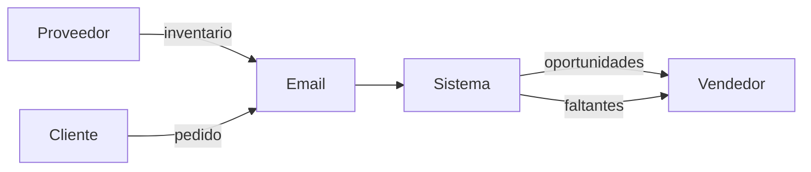
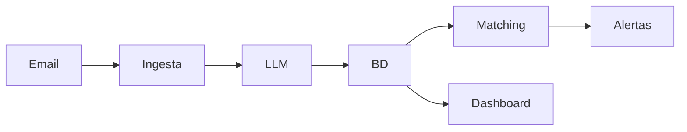
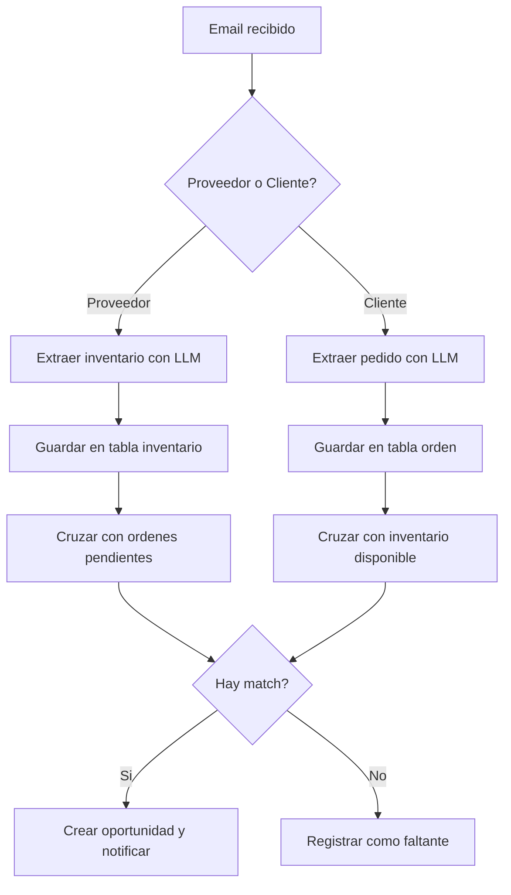
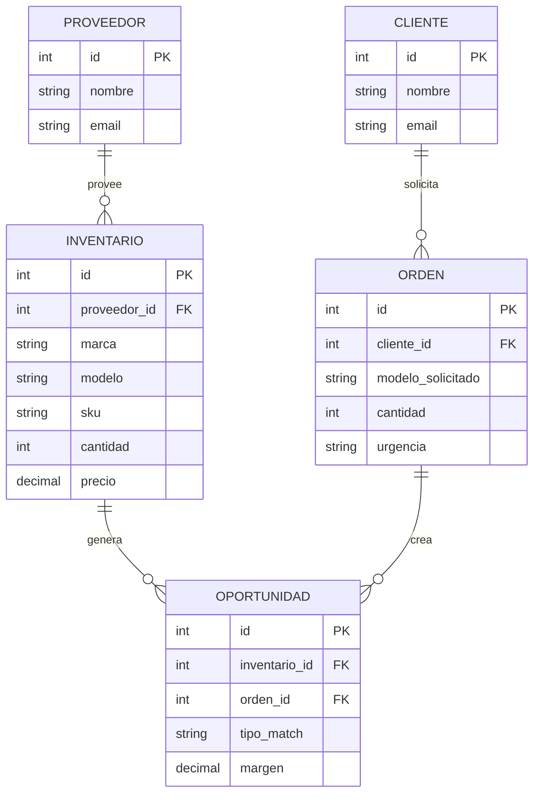
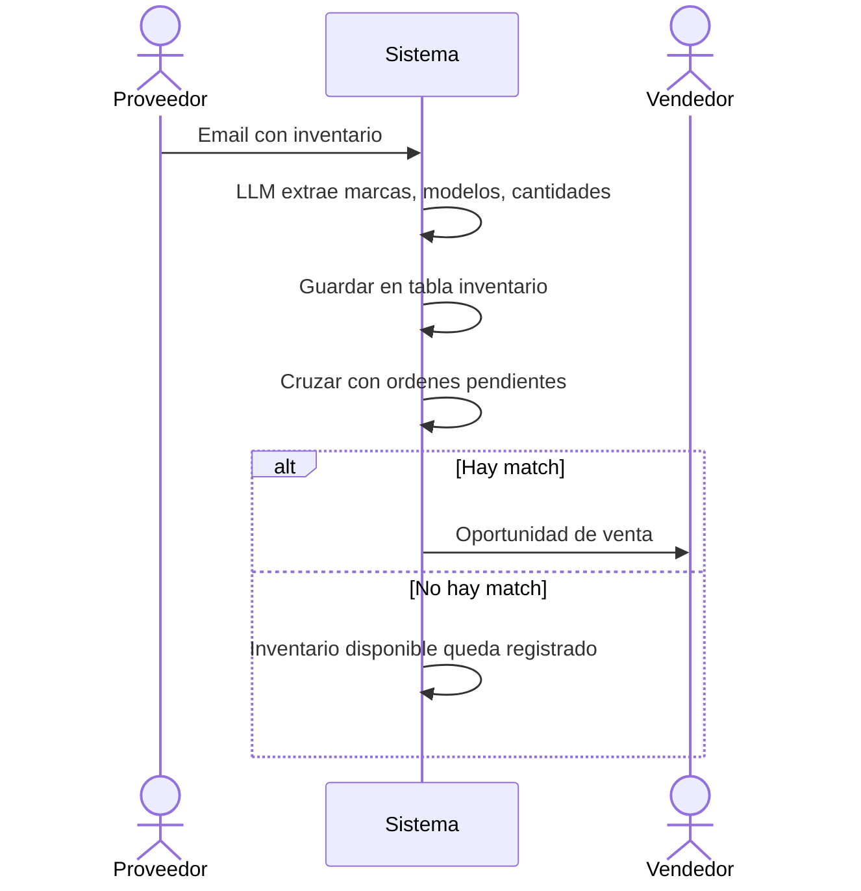
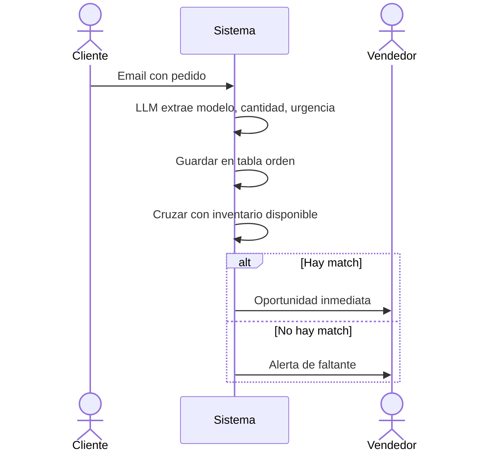
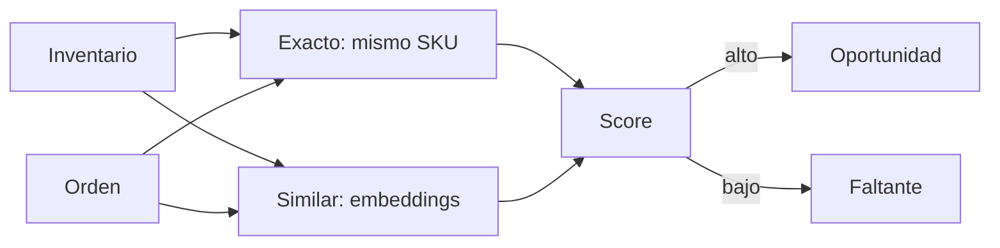
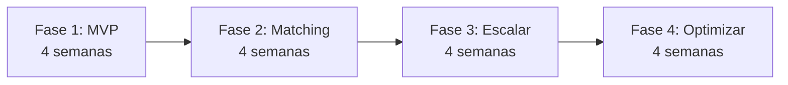

---
notebook:
  - "[[Mantenimicros]]"
  - "[[Félix]]"
tags:
  - proyecto
---

# Automatización de Correos para Mantenimicros

## Resumen

Mantenimicros es intermediario: recibe inventario de proveedores y pedidos de clientes, todo por email. El objetivo es automatizar la extracción de datos de esos emails con un LLM y luego cruzar oferta vs. demanda para identificar oportunidades de venta o faltantes de inventario.

---

## Arquitectura General

Arquitectura **orientada a eventos**: cada email dispara un procesamiento asíncrono que termina en una notificación al equipo comercial.

| Componente | Función |
|------------|---------|
| Email Connector | Recibe emails (IMAP/webhook) |
| LLM | Extrae datos estructurados del texto |
| Base de datos | Inventario, órdenes, matches |
| Matching Engine | Cruza demanda vs. oferta |
| Dashboard + Alertas | Muestra oportunidades al vendedor |

---

## 1. Contexto del Sistema



Proveedores envían inventario y clientes envían pedidos por email. El sistema procesa ambos y le entrega al vendedor: oportunidades listas para vender, y alertas de lo que falta en inventario.

---

## 2. Arquitectura Interna



Flujo lineal y simple:
1. **Ingesta** recibe el email
2. **LLM** extrae los datos (marca, modelo, cantidad, precio)
3. **BD** guarda inventario u orden
4. **Matching** cruza oferta con demanda
5. **Dashboard** y **Alertas** muestran resultados

---

## 3. Flujo de Procesamiento



---

## 4. Modelo de Datos



---

## 5. Secuencia: Email de Proveedor



---

## 6. Secuencia: Email de Cliente



---

## 7. Lógica de Matching



Tres niveles de matching:
- **Exacto**: mismo SKU o modelo
- **Similar**: por embeddings (ej: "ThinkPad T14" ≈ "ThinkPad T14s")
- **Sin coincidencia**: se registra como faltante para negociar con proveedores

---

## 8. Stack Sugerido (para empezar rápido)

| Componente        | Herramienta           |
| ----------------- | --------------------- |
| Ingesta de emails | n8n + Gmail API       |
| LLM               | OpenAI GPT-4          |
| Base de datos     | PostgreSQL + pgvector |
| Backend/API       | Node.js / FastAPI     |
| Dashboard         | Next.js               |
| Alertas           | Email / Slack         |

---

## 9. Roadmap



- **Fase 1** — Ingesta de emails + extracción con LLM + BD básica
- **Fase 2** — Matching exacto + notificaciones + dashboard
- **Fase 3** — Matching semántico con embeddings + scoring + reportes de faltantes
- **Fase 4** — Predicción de demanda + integración con ERP/contabilidad

---

## Próximos Pasos

1. Validar arquitectura con el equipo
2. Definir MVP: ¿qué tan rápido necesitan ver resultados?
3. Elegir stack según presupuesto y expertise
4. Diseñar prompt de LLM para extracción
5. Prototipar con n8n

## Prompt de Extracción (referencia)

```
Eres un extractor de datos de emails de comercio de equipos de cómputo.
Analiza el siguiente email y extrae información estructurada.

TIPO DE EMAIL: [PROVEEDOR o CLIENTE]

Si es PROVEEDOR, extrae:
- Lista de productos: marca, modelo, SKU, cantidad, precio, condición

Si es CLIENTE, extrae:
- Producto solicitado: marca, modelo/especificaciones, cantidad, presupuesto, urgencia

Responde SOLO en JSON.
```

---

*Documento para Mantenimicros - Automatización de Correos*