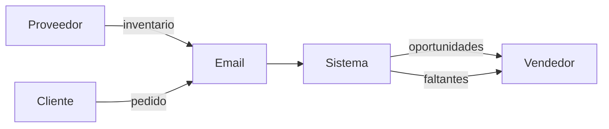
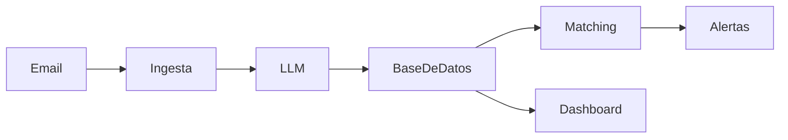
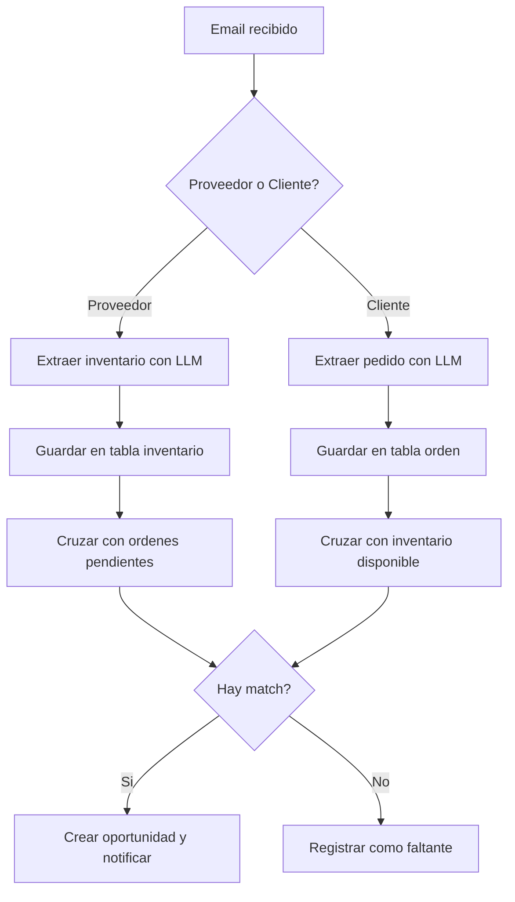
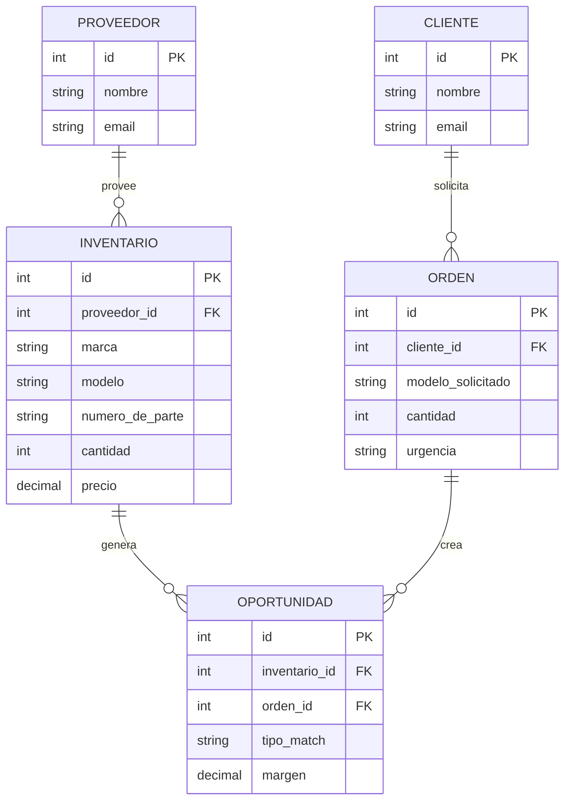
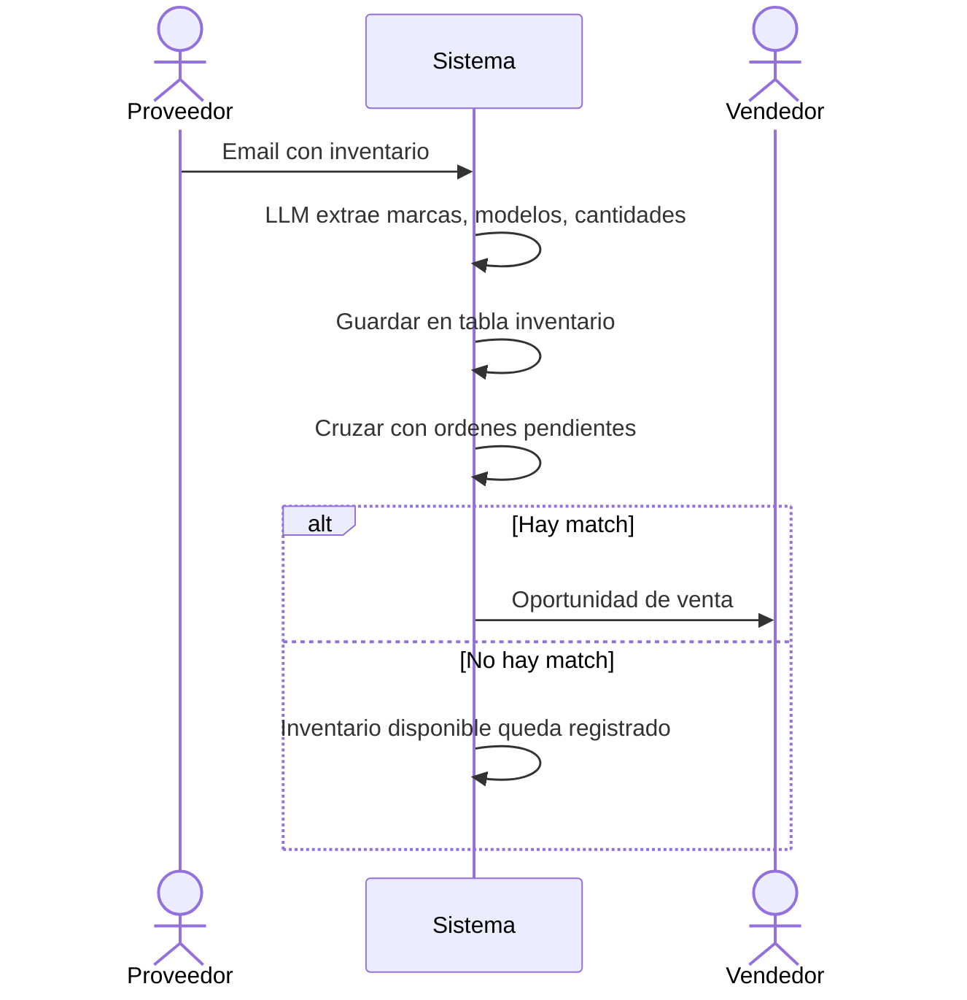
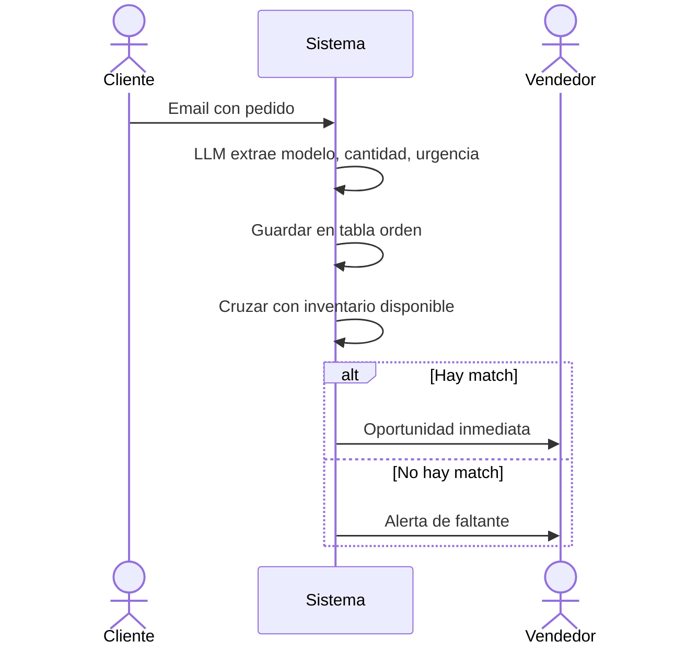
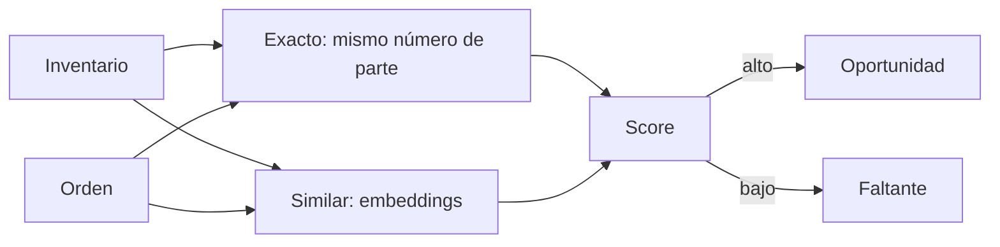
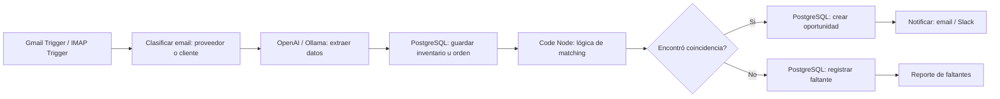
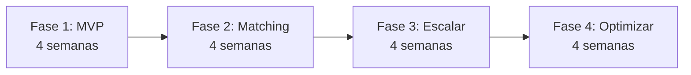

---
notebook:
  - "[[Mantenimicros]]"
  - "[[Félix]]"
tags:
  - proyecto
---

# Automatización de Correos para Mantenimicros

## Resumen

Mantenimicros es intermediario: recibe inventario de proveedores y pedidos de clientes, todo por email. El objetivo es automatizar la extracción de datos de esos emails con un LLM y luego cruzar oferta vs. demanda para identificar oportunidades de venta o faltantes de inventario.

---

## Arquitectura General

Arquitectura **orientada a eventos**: cada email dispara un procesamiento asíncrono que termina en una notificación al equipo comercial.

| Componente | Función |
|------------|---------|
| Email Connector | Recibe emails (IMAP/webhook) |
| LLM | Extrae datos estructurados del texto |
| Base de datos | Inventario, órdenes, matches |
| Matching Engine | Cruza demanda vs. oferta |
| Dashboard + Alertas | Muestra oportunidades al vendedor |

---

## 1. Contexto del Sistema



Proveedores envían inventario y clientes envían pedidos por email. El sistema procesa ambos y le entrega al vendedor: oportunidades listas para vender, y alertas de lo que falta en inventario.

---

## 2. Arquitectura Interna



Flujo lineal y simple:
1. **Ingesta** recibe el email
2. **LLM** extrae los datos (marca, modelo, cantidad, precio)
3. **Base de datos** guarda inventario u orden
4. **Matching** cruza oferta con demanda
5. **Dashboard** y **Alertas** muestran resultados

---

## 3. Flujo de Procesamiento



---

## 4. Modelo de Datos



---

## 5. Secuencia: Email de Proveedor



---

## 6. Secuencia: Email de Cliente



---

## 7. Lógica de Matching



Tres niveles de matching:
- **Exacto**: mismo número de parte o modelo
- **Similar**: por embeddings (ej: "ThinkPad T14" ≈ "ThinkPad T14s")
- **Sin coincidencia**: se registra como faltante para negociar con proveedores

---

## 8. Stack Local con n8n

Sí, es completamente factible correr n8n de forma local. n8n es una plataforma de automatización de código abierto que se auto-hospeda fácilmente con Docker. Tiene nodos nativos para leer emails, llamar LLMs, conectarse a bases de datos y enviar notificaciones, por lo que puede orquestar todo el flujo sin necesidad de un backend separado.

n8n ofrece un **Self-hosted AI Starter Kit**: un `docker-compose.yml` que levanta n8n + Ollama + Qdrant + PostgreSQL de una sola vez. Es el punto de partida ideal para este proyecto, porque ya incluye todo lo que necesitamos: automatización, LLM local, base de datos vectorial y base de datos relacional.

### Componentes del Stack

| Componente | Herramienta | Función en el flujo |
|------------|-------------|---------------------|
| Orquestación | n8n (Docker) | Ejecuta todo el workflow: lee email → LLM → guarda → matching → notifica |
| LLM | Ollama (Docker) o OpenAI API | Extrae datos estructurados de los emails |
| Base de datos | PostgreSQL (Docker) | Inventario, órdenes, oportunidades |
| Base vectorial | Qdrant (Docker) | Embeddings para matching semántico |
| Dashboard | Next.js o n8n mismo | Visualización de oportunidades |
| Alertas | n8n (nodoficación propia) | Email, Slack, WhatsApp |

### Por qué n8n local funciona para este caso

- **Nodos de email nativos**: Gmail Trigger e IMAP Trigger leen emails automáticamente sin código
- **Nodo OpenAI/Ollama**: llama al LLM directamente desde el workflow
- **Nodo PostgreSQL**: lee y escribe en la base de datos sin backend intermedio
- **Nodo HTTP Request**: llama a Qdrant para embeddings y búsqueda vectorial
- **Nodo Code (JavaScript)**: escribe lógica de matching customizada adentro del workflow
- **Ejecución local**: todo corre en tu computador, sin costos de cloud
- **UI visual**: ves y editas el flujo completo con drag and drop

### Limitaciones a considerar

- **Escalabilidad**: en un computador personal, el límite es la memoria y CPU. Para volúmenes altos (>500 emails/día), convendría migrar a un servidor dedicado
- **Disponibilidad**: si el computador se apaga, los workflows se pausan. n8n reanuda automáticamente al reiniciar, pero hay ventana de tiempo sin procesamiento
- **GPU para LLM local**: Ollama funciona mejor con GPU. Sin GPU, se puede usar OpenAI API como alternativa y sigue corriendo n8n de forma local

### Docker Compose de referencia

```yaml
# docker-compose.yml — basado en el AI Starter Kit de n8n
services:
  n8n:
    image: docker.n8n.io/n8nio/n8n
    ports:
      - "5678:5678"
    environment:
      - DB_TYPE=postgresdb
      - DB_POSTGRESDB_HOST=postgres
      - DB_POSTGRESDB_PORT=5432
      - DB_POSTGRESDB_DATABASE=n8n
      - DB_POSTGRESDB_USER=n8n
      - DB_POSTGRESDB_PASSWORD=n8n
      - N8N_ENFORCE_SETTINGS_FILE_PERMISSIONS=true
    volumes:
      - n8n_data:/home/node/.n8n
    depends_on:
      - postgres

  postgres:
    image: postgres:16
    environment:
      - POSTGRES_USER=n8n
      - POSTGRES_PASSWORD=n8n
      - POSTGRES_DB=n8n
    volumes:
      - postgres_data:/var/lib/postgresql/data
    ports:
      - "5432:5432"

  ollama:
    image: ollama/ollama
    volumes:
      - ollama_data:/root/.ollama
    ports:
      - "11434:11434"

  qdrant:
    image: qdrant/qdrant
    volumes:
      - qdrant_data:/qdrant/storage
    ports:
      - "6333:6333"

volumes:
  n8n_data:
  postgres_data:
  ollama_data:
  qdrant_data:
```

Para levantar todo: `docker compose up -d`. n8n queda en `http://localhost:5678`.

### Workflow en n8n (vista conceptual)



Cada nodo del diagrama es un nodo nativo de n8n. No hay que escribir un backend separado: el workflow de n8n es el backend.

---

## 9. Roadmap



- **Fase 1** — Ingesta de emails + extracción con LLM + base de datos básica
- **Fase 2** — Matching exacto + notificaciones + dashboard
- **Fase 3** — Matching semántico con embeddings + scoring + reportes de faltantes
- **Fase 4** — Predicción de demanda + integración con ERP/contabilidad

---

## Próximos Pasos

1. Validar arquitectura con el equipo
2. Definir MVP: ¿qué tan rápido necesitan ver resultados?
3. Elegir stack según presupuesto y expertise
4. Diseñar prompt de LLM para extracción
5. Prototipar con n8n

## Prompt de Extracción (referencia)

```
Eres un extractor de datos de emails de comercio de equipos de cómputo.
Analiza el siguiente email y extrae información estructurada.

TIPO DE EMAIL: [PROVEEDOR o CLIENTE]

Si es PROVEEDOR, extrae:
- Lista de productos: marca, modelo, número de parte, cantidad, precio, condición

Si es CLIENTE, extrae:
- Producto solicitado: marca, modelo/especificaciones, cantidad, presupuesto, urgencia

Responde SOLO en JSON.
```

---

*Documento para Mantenimicros - Automatización de Correos*